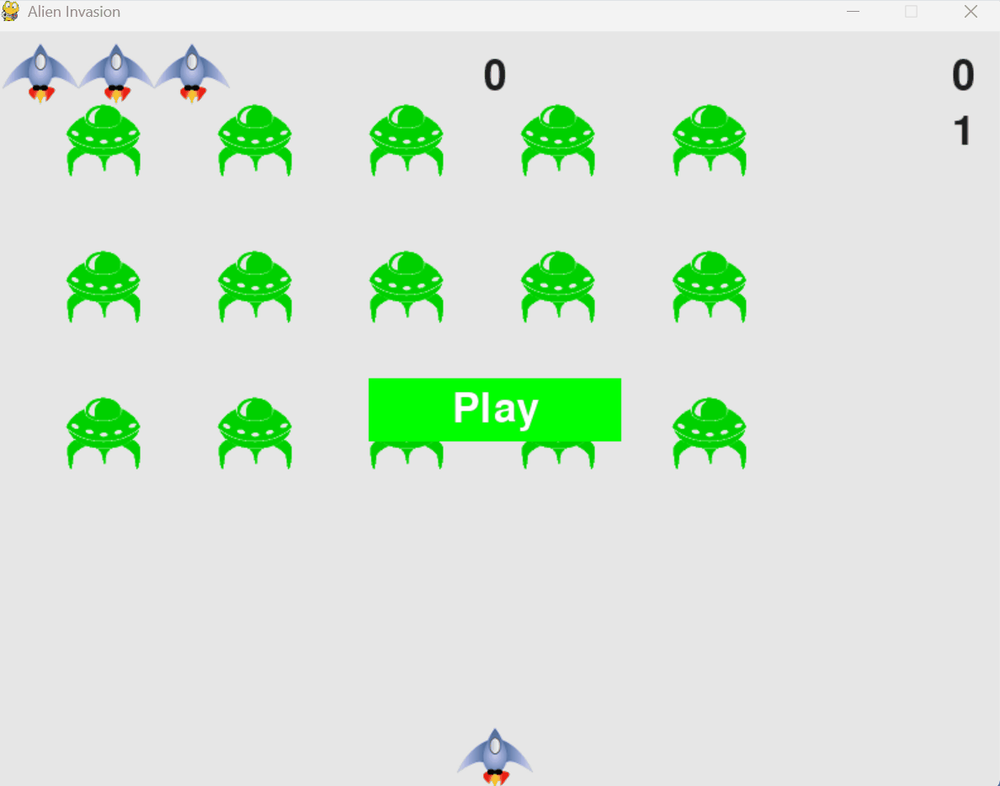

# Alien Invasion 🛸

A side-scrolling arcade shooter built with Python and Pygame. This project demonstrates core Object-Oriented Programming (OOP) principles, real-time event handling, and dynamic scaling logic.

<p align="center">
   
</p>

## 🚀 Overview
Alien Invasion is a project focused on creating a functional game engine from scratch. The player controls a ship, defends against waves of alien fleets, and earns points to reach new high scores. As the player progresses, the game increases in speed and difficulty.

## ✨ Key Features
*   **Dynamic Difficulty:** The game speeds up and point values increase as you clear levels.
*   **Scoreboard System:** Real-time tracking of current score, high score, level, and remaining lives.
*   **Collision Engine:** Managed sprite interactions for projectiles and enemy units.
*   **State Management:** Seamless transitions between the "Play" menu and active gameplay.

## 🛠️ Technical Architecture
*   **Language:** Python 3.9
*   **Library:** Pygame
*   **Pattern:** Object-Oriented Programming (OOP)
*   **Modules:** 
    *   `ship.py`, `alien.py`, `bullet.py`: Manage individual game assets.
    *   `game_stats.py` & `scoreboard.py`: Handle data tracking and UI rendering.
    *   `settings.py`: Centralized configuration for easy balancing.

## 🧠 Challenges & Problem Solving
During development, I encountered a logic error where the high score was overwriting the current session score. I identified that the assignment was reversed in the `check_high_score()` method. By refactoring the logic to correctly assign the current score to the high score variable only upon reaching a new milestone, I ensured data integrity within the `GameStats` object.

## 🎮 Installation & Controls

### 1. Prerequisites
Ensure you have Python installed. You will also need the `pygame` library:
```bash
pip install pygame
```
### 2. Running the game.
Navigate to the project folder and run:
```bash
python alien_invasion.py
```

### 3.🎮 Controls

The game is controlled using the keyboard and mouse:

| Action             | Input Key / Device |
| :----------------- | :----------------- |
| **Move Left**      | Left Arrow Key     |
| **Move Right**     | Right Arrow Key    |
| **Fire Bullet**    | Spacebar           |
| **Start Game**     | 'Play' Button (Mouse Click) |
| **Quit Game**      | 'Q' Key            |
| **Full Screen/Exit**| System Default    |

## 📄 License
This project is licensed under the MIT License - see the [LICENSE](LICENSE) file for details.
